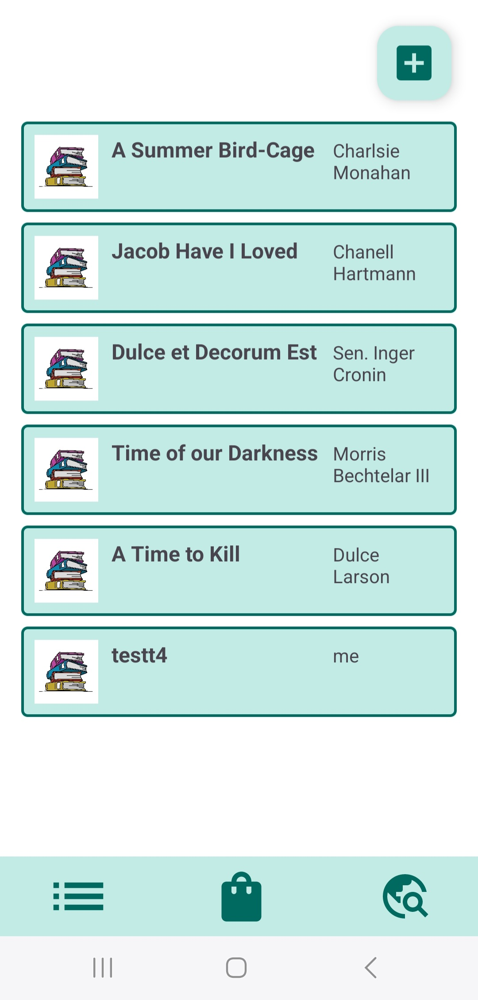
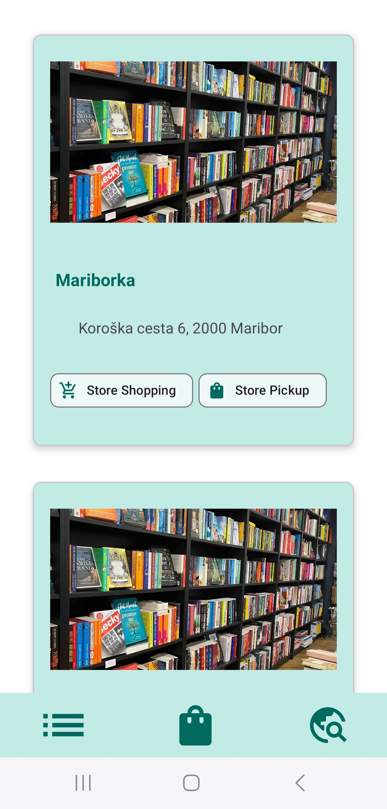
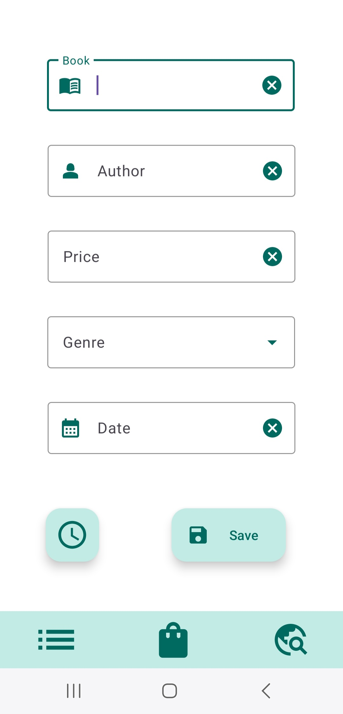
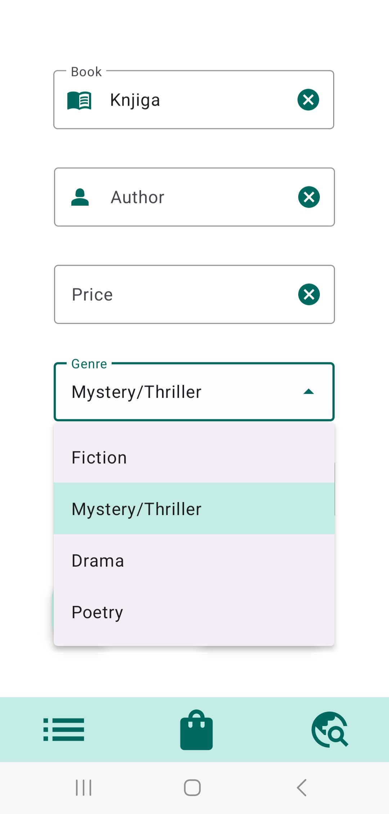
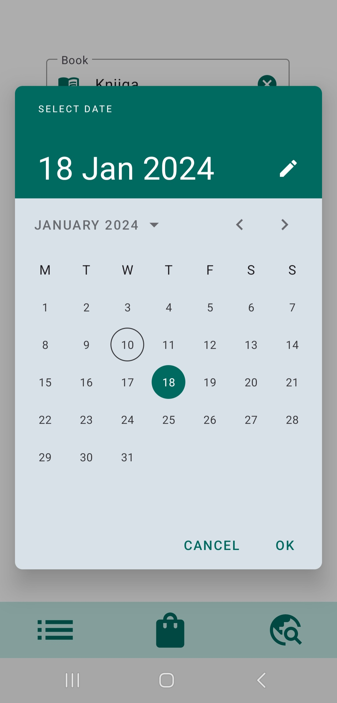
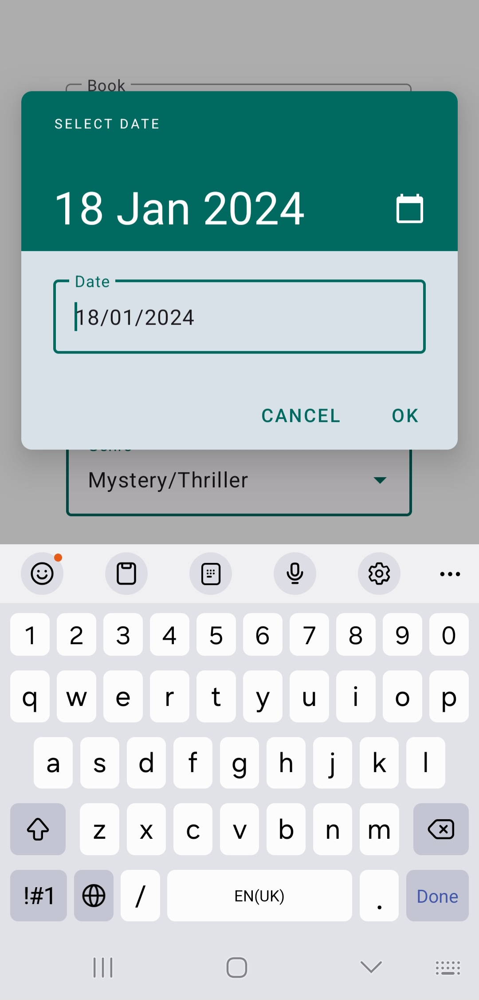

# [Material Components for Android](https://github.com/material-components/material-components-android)

**Material Components** za Android je sistem oblikovanja, ki ga je ustvaril Google in zagotavlja celovit nabor komponent uporabniškega vmesnika in smernic za izdelavo sodobnih aplikacij za Android. Te komponente so skladne z načeli oblikovanja Material Design, oblikovalskega jezika, ki ga je uvedel Google in poudarja čist, dosleden in odziven uporabniški vmesnik. Knjižnica Material Components za Android razvijalcem omogoča, da v svoje aplikacije preprosto implementirajo oblikovanje Material Design, saj zagotavlja vnaprej pripravljene, prilagodljive elemente uporabniškega vmesnika.

## Zakaj?

1. **Dosleden jezik oblikovanja:** Material Components se usklajujejo z Googlovimi načeli oblikovanja Material Design, kar zagotavlja dosleden in vizualno privlačen oblikovalski jezik med aplikacijami.

2. **Odziven uporabniški vmesnik:** Komponente so zasnovane tako, da so odzivne, kar zagotavlja brezhibno uporabniško izkušnjo na različnih velikostih zaslonov in naprav.

3. **Bogat nabor komponent:** Knjižnica zagotavlja bogato zbirko vnaprej pripravljenih komponent uporabniškega vmesnika.

4. **Časovna učinkovitost:** Ker zagotavlja obsežen nabor vnaprej pripravljenih komponent uporabniškega vmesnika, razvijalcem prihrani dragocen čas pri ustvarjanju in oblikovanju splošnih elementov od začetka.

5. **Prilagodljivost:** Komponente so prilagodljive in nastavljive, tako da lahko razvijalci prilagodijo uporabniški vmesnik zahtevam svojih aplikacij.

6. **Stalna podpora:** Google knjižnico aktivno vzdržuje in posodablja, kar zagotavlja združljivost z najnovejšimi različicami sistema Android ter stalno podporo za nove funkcije in izboljšave.

## Prednosti in slabosti

| Prednosti :heavy_plus_sign: | Slabosti :heavy_minus_sign: |
|-----------------------------|-----------------------------|
| Dosleden jezik oblikovanja  | Povečana velikost aplikacije|
| Jasna navodila za oblikovanje | Krivulja učenja            |
| Oblikovanje in prilagajanje  | Omejena svoboda oblikovanja |
| Prilagodljivost             | Prilagojena za posamezno platformo |
| Dostopnost                  | Preveč motečih elementov    |
| Kontinuirane izboljšave     | Združljivost različic       |


## [Licenca](https://github.com/material-components/material-components-android/tree/master?tab=Apache-2.0-1-ov-file)
Apache 2.0 licenca

## Zanimivi podatki

- *Najnovejša različica:* [1.11.0](https://github.com/material-components/material-components-android/releases/tag/1.11.0)
- *Zadnja posodobitev:* 9. januar 2024
- *Prvič predstavljena:* 25. junij 2014
- *Contributors:* 186

## Namestitev
Dodajte v build.gradle (Modul: app):
```
dependencies {
    implementation("com.google.android.material:material:1.11.0")
}
```

## Osnovne funkcionalnosti
Knjižnico sem vključila in uporabila v svojo drugo aplikacijo pri tem predmetu.

<div style="display: flex; justify-content: space-between;">
  
  
  
</div>

<div style="display: flex; justify-content: space-between;">
  
  
</div>

<div style="display: flex; justify-content: space-between;">
  
  
</div>
